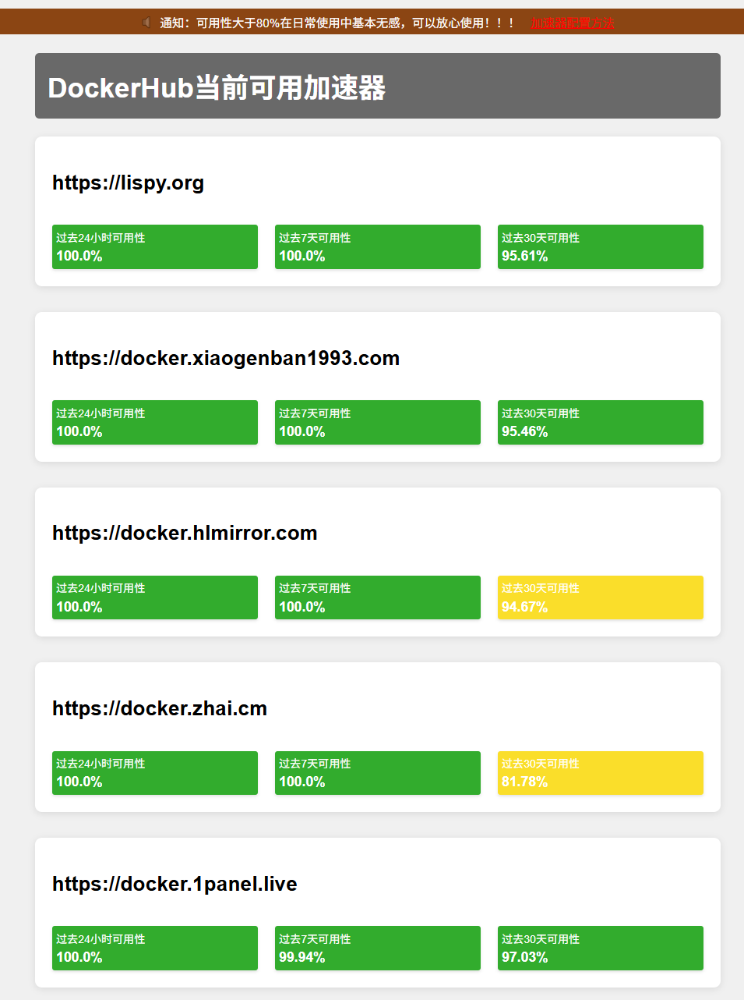

# Registry Mirrors 监控系统

这是一个用于监控Docker Registry镜像源可用性的工具。系统会定期检测多个镜像源的状态，并提供实时的可用性统计数据。

## 功能特点

- 自动监控多个Docker Registry镜像源的可用性
- 提供1天、7天、30天的可用性统计数据
- 实时更新监控状态
- Web界面展示监控结果
- 支持多级排序展示

## 环境要求

- Python 3.7+
- Docker
- Flask 2.0.1

## 安装说明

1. 克隆项目到本地：
   ```bash
   git clone [repository_url]
   cd registry-mirrors
   ```

2. 安装依赖：
   ```bash
   pip install -r website-monitor/requirements.txt
   ```

## 使用方法

### 直接运行

执行以下命令启动服务：
```bash
./run.sh
```
或
```bash
python3 ./website-monitor/website_monitor.py
```

### Docker部署

#### 使用docker-compose（推荐）

1. 确保已安装docker-compose

2. 在项目根目录下运行：
   ```bash
   docker-compose up -d
   ```

这种方式会自动处理镜像构建和容器运行，更加简单和便捷。

#### 使用Docker命令

1. 构建Docker镜像：
   ```bash
   docker build -t registry-mirrors .
   ```

2. 运行容器：
   ```bash
   docker run -d -p 15000:15000 registry-mirrors
   ```

服务启动后，访问 `http://localhost:15000` 即可查看监控界面。

## 监控指标

- 1天可用性：最近24小时的可用性百分比
- 7天可用性：最近7天的可用性百分比
- 30天可用性：最近30天的可用性百分比

系统每5分钟进行一次状态检查，通过尝试拉取busybox镜像来测试镜像源的可用性。

## 工具截图

